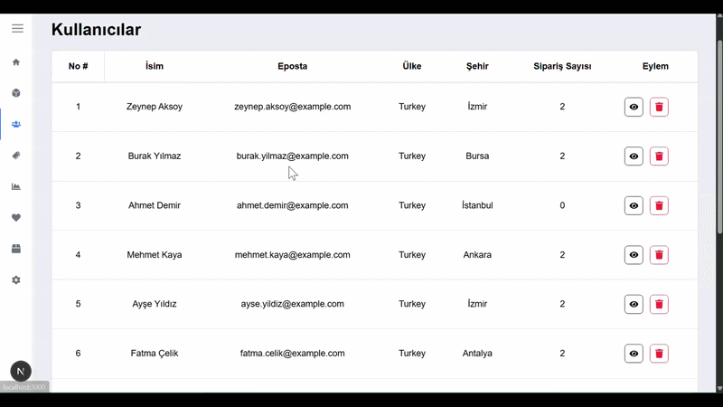
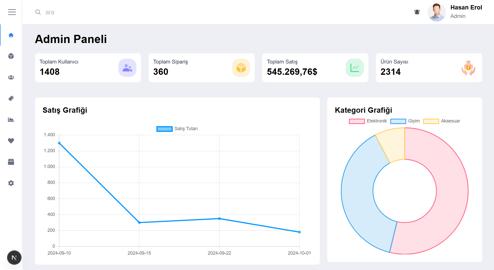
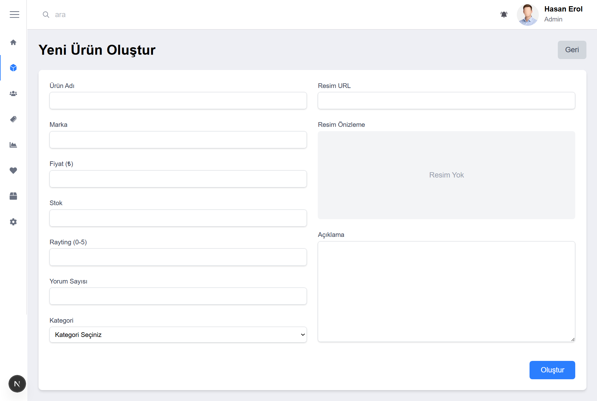

# 📊 E-Commerce Admin Dashboard

Modern web teknolojileriyle geliştirilmiş, veri odaklı ve tam fonksiyonel bir yönetim paneli. Bu proje; ürün envanteri, kullanıcı veritabanı ve sipariş geçmişini merkezi bir sistem üzerinden yönetmek için tasarlanmıştır.

## 🚀 Temel Özellikler

* **Dinamik Dashboard:** Satış verilerini (Toplam Satış, Sipariş, Kullanıcı) anlık olarak özetleyen kartlar ve eğilimleri gösteren grafikler.
* **Gelişmiş Veri Yönetimi (CRUD):** Ürünler, kullanıcılar ve siparişler için tam fonksiyonel yönetim araçları.
* **Bildirim Sistemi:** İşlem sonuçlarını kullanıcıya anlık bildiren `react-toastify` entegrasyonu.
* **Görsel Analiz:** Verilerin grafiksel gösterimi için `Chart.js` ve `react-chartjs-2` kullanımı.

## 🛠️ Teknik Stack

* **Framework:** Next.js 16.1.6 (App Router)
* **Kütüphane:** React 19.2.3
* **Dil:** TypeScript
* **Stil:** Tailwind CSS 4
* **Grafik:** Chart.js
* **Mock Backend:** JSON Server

## 🎥 Demo


Aşağıda projenin temel arayüzlerine ait görseller yer almaktadır:

| Genel Bakış (Dashboard) | Ürün Yönetimi |
| :--- | :--- |
|  |  |

| Yeni Ürün Formu |
| :--- |
|  |


## 📦 Kurulum ve Çalıştırma

Projeyi yerel makinenizde çalıştırmak için:

### 🚀 Projeyi Klonlayın
```
git clone https://github.com/HasanEROL1/next-admin
cd next-admin

### 📦 Bağımlılıkları Yükleyin:
```
   npm install

### 🚀  ** API Sunucusunu Başlatın (Port: 9090):
```
  *API varsayılan olarak `http://localhost:9090` adresinde çalışacaktır.*

### 🚀 **Uygulamayı Başlatın:**
```
   npm run dev
   ```

## 📂 Proje Yapısı
db.json: Tüm ürün, kullanıcı ve sipariş verilerini içeren mock veritabanı.

- src/types: TypeScript tip tanımlamaları.

- package.json: Proje bağımlılıkları ve scriptler.

Geliştirici: Hasan Erol

Web: hasanerol.dev


